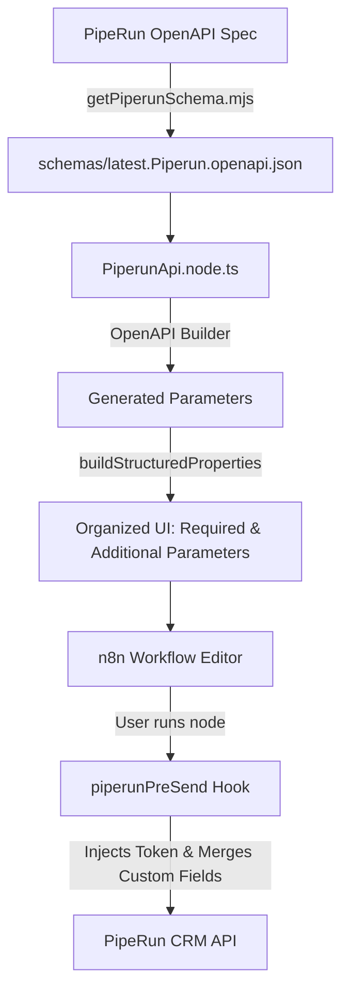

# How This Project Works

This project is an **n8n community node** that integrates [PipeRun CRM](https://pipe.run) into n8n workflows.

Instead of manually writing code for every single CRM endpoint (over 200 operations), this node translates PipeRun's official **OpenAPI 3.0 specification** directly into native n8n UI parameters and declarative HTTP requests.

---

## High-Level Architecture



---

## Step-by-Step Flow

### 1. Schema Management (`schemas/` & `scripts/`)

- **PipeRun OpenAPI Spec**: PipeRun publishes its API documentation using an OpenAPI 3.0 schema.
- **Fetch Script (`npm run getPiperunSchema`)**:
  - Downloads the latest schema from PipeRun.
  - Archives the previous file with a date stamp (e.g., `YYYYMMDD.Piperun.openapi.json`) to track upstream API changes.
  - Saves the new version as `schemas/latest.Piperun.openapi.json`.
- **Organize Script (`npm run organizePiperunSchemaPaths`)**:
  - Sorts all API paths alphabetically by tag, URL category, and route.
  - Ensures deterministic file output and clean Git diffs.

---

### 2. Node Generation (`nodes/PiperunApi/PiperunApi.node.ts`)

When the TypeScript code compiles, it processes the schema:

1. **Sanitization**: Fixes quirks in the upstream OpenAPI file (such as empty or unsupported request bodies on certain DELETE routes).
2. **OpenAPI Parser (`@devlikeapro/n8n-openapi-node`)**:
   - Converts OpenAPI **Tags** into n8n **Resources** (e.g., Accounts, Deals, Activities).
   - Converts OpenAPI **Operations** into n8n **Actions/Operations** (e.g., Create Deal, List Accounts).
   - Converts URL/query parameters and JSON request bodies into n8n input fields.

---

### 3. UI Structuring (`buildStructuredProperties`)

If all 200+ operations showed dozens of optional fields at once, the n8n UI would be unusable. To keep things clean:

- **Required Fields**: Displayed directly on the node interface (e.g., Title, Pipeline ID).
- **Additional Parameters**: Optional fields are grouped into a collapsible collection dropdown ("Add Parameter").
- **100% Coverage**: Every single operation receives an `Additional Parameters` collection, even if the static OpenAPI schema didn't define optional fields for that route.

---

### 4. Custom Fields & Query Parameters (`piperunPreSend`)

PipeRun users frequently need fields that aren't part of the static schema (such as custom deal fields or undocumented filter query parameters).

Every operation includes four custom inputs under **Additional Parameters**:
1. **Custom Query Parameters**: Key-value pairs appended to the URL query string.
2. **Custom Query (JSON)**: Raw JSON merged into query parameters.
3. **Custom Body Fields**: Key-value pairs merged directly into the root request body.
4. **Custom Body (JSON)**: Raw JSON merged directly into the root request body.

Before n8n fires the HTTP request, the **`piperunPreSend`** hook runs:
- Reads the active operation's custom inputs.
- Automatically handles numbers, booleans, and JSON objects entered by the user.
- Merges them into `requestOptions.qs` and `requestOptions.body` without modifying native PipeRun fields.

---

### 5. Authentication (`credentials/PiperunApi.credentials.ts`)

- The credential file defines a single required field: **Token**.
- PipeRun requires authentication via the `token` HTTP header:
  ```http
  token: <YOUR_USER_TOKEN>
  ```
- n8n automatically attaches this header to all outgoing requests to `https://api.pipe.run/v1`.

---

## Summary of Key Files

| File / Folder | Purpose |
| :--- | :--- |
| `schemas/latest.Piperun.openapi.json` | The PipeRun OpenAPI specification used to build the node. |
| `scripts/getPiperunSchema.mjs` | Fetches, archives, and organizes the OpenAPI schema. |
| `scripts/organizePiperunSchemaPaths.mjs` | Alphabetically sorts schema endpoints for clean Git diffs. |
| `credentials/PiperunApi.credentials.ts` | Handles PipeRun user token authentication. |
| `nodes/PiperunApi/PiperunApi.node.ts` | Main node definition: builds the UI, adds custom fields, and registers the `preSend` hook. |
